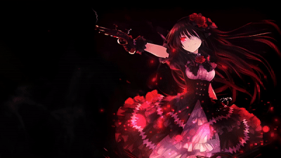

  

 

 

## About Me

I'm the beginner in web app development, still learning step by step. Most of what I've built so far comes from studying existing open source projects, taking them apart, and rebuilding them to understand how they work — then slowly adding my own features on top.

Right now I'm focused on WhatsApp/Telegram bots, simple web storefronts, and reseller systems for game server hosting. Still a lot to learn, but I enjoy the process and keep pushing forward one project at a time.

 

  

 

## Tools & Platform

## Tech Stack

 

## GitHub Stats

 

 

## Featured Projects

 

